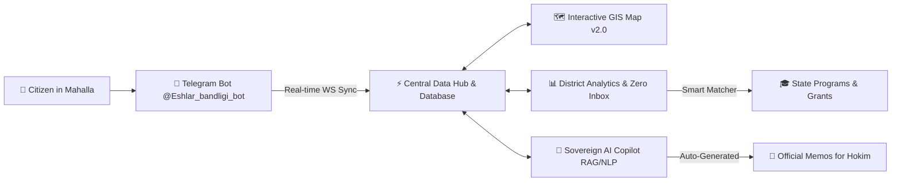

# 🏛️ Yoshlar Bandligi — GovTech 2.0 (NEXUS30)
> **Sovereign Youth Employment Monitoring, NEET Predictive Triage & Smart Support Routing Ecosystem**  
> *Developed for the NEXUS30 Hackathon (GovTech Track) • Mirzo-Ulugbek District, Tashkent*

<div align="center">

[](https://reactjs.org/)
[](https://www.typescriptlang.org/)
[](https://tailwindcss.com/)
[](https://vitejs.dev/)
[](https://leafletjs.com/)
[](https://t.me/Eshlar_bandligi_bot)
[](https://vercel.com/)

[**🌐 Live Demo**](#) • [**🤖 Telegram Bot**](https://t.me/Eshlar_bandligi_bot) • [**📖 Pitch Guide**](#-pitch-guide) • [**⚙️ Architecture**](#-system-architecture)

</div>

---

## 📌 Executive Summary

**Yoshlar Bandligi GovTech 2.0** is an omnichannel digital operating system designed for municipal district authorities (*Hokimiyat*) and grassroots youth inspectors (*«Ёшлар етакчиси»*). 

The platform tackles youth unemployment (ages 18–30) by identifying hidden **NEET** (*Not in Education, Employment, or Training*) individuals using indirect signals, streamlining door-to-door field verification, and routing citizens to state programs in **1 click** (*«Ishga Marhamat» Monocenter, IT-Park bootcamps, and «Yoshlar Daftari» grants*).



---

## 🌟 Key Platform Capabilities

### 1. 📊 Executive District Situational Dashboard
- Real-time aggregation of employment metrics across all **8 canonical mahallas** of Mirzo-Ulugbek district.
- **Zero Inbox Methodology:** Daily prioritized door-to-door visit quotas calculated by NEET risk scores.
- Dynamic cascading animated charts (Recharts + SVG) with smooth cubic-bezier easing.
- Full bilingual localization: **Русский** / **O‘zbek tili (Lotin alifbosi)**.

### 2. 🗺️ Interactive GIS Map Engine v2.0
- Canonical GPS vector polygons for 8 mahallas with real coordinates.
- **Heatmap Layering:** Switch between NEET Risk Zones, Employment Rate (%), Support Coverage, and Density.
- Points of Interest (POI) mapping: Monocenters, IT-Park Hubs, ABBM Employment Centers, Coworkings.
- Distance calculation & automated routing lines from mahalla centroid to nearest career facility.
- 3-Phase cinematic camera navigation with tile pre-buffering.

### 3. ⚡ Human-in-the-Loop NEET Triage
- **Predictive Scoring:** Automated candidate flagging based on tax gaps, diploma timelines, and labor registry status.
- **Door-to-door Verification:** Inspectors verify status on-site with audit trails and timestamped status histories.
- Eliminates ghost registries and paper bureaucracy.

### 4. 📲 Real-Time Telegram Bot (`@Eshlar_bandligi_bot`)
- Field-ready mobile companion for youth inspectors during door-to-door visits (*Xonadonbay o‘rganish*).
- Instant profile creation, status updates, and live two-way WebSocket synchronization with the Web Dashboard.
- One-click `.xlsx` Excel export and automatic memo generator.

### 5. 🤖 Sovereign AI Copilot (Hokimiyat Advisor)
- In-memory RAG & NLP engine operating without external dependency risks.
- Instant automated generation of official memos (*Служебная записка для Хокима*).
- Smart allocation of «Yoshlar Daftari» fund quotas and skill search.

### 6. 🎯 Smart Support Matcher
- Tailored recommendation engine suggesting highest-impact state programs:
  - **Monocenter «Ishga Marhamat»:** 24 vocational tracks + monthly stipends.
  - **IT-Park & IT-Bilim:** Coding bootcamps + laptop subsidies.
  - **«Yoshlar Daftari» Foundation:** Grants up to 10M UZS for equipment.
  - **State Microcredits:** 14% preferential business loans.

---

## 🏗️ Tech Stack & Architecture

| Layer | Technology |
|---|---|
| **Frontend Framework** | React 18.3, TypeScript 5.7, Vite 6.4 |
| **Styling & Design System** | TailwindCSS 3.4, Linear Dark Aesthetic, Custom Micro-animations |
| **GIS & Mapping** | Leaflet 1.9, CartoDB Dark Matter / ESRI Satellite Tiles |
| **Data Visualization** | Recharts 2.15, Bespoke SVG Animated Slices |
| **Icons & UI Utilities** | Lucide React, clsx, tailwind-merge |
| **Backend & Sync** | Node.js, Express 5, WebSockets (`ws`), Grammy Telegram Bot Framework |
| **Export & Documents** | ExcelJS, UTF-8 BOM CSV Engine, Native Browser Print Portal |
| **Deployment** | Vercel SPA Engine (`vercel.json`) |

---

## 🚀 Quick Start & Local Setup

### Prerequisites
- Node.js `v18+` or `v20+`
- npm `v9+`

### Installation

```bash
# 1. Clone the repository
git clone https://github.com/fluxo159/NEVERLOSE-Memesense.git
cd NEVERLOSE-Memesense

# 2. Install dependencies
npm install

# 3. Start Frontend & Backend concurrently
npm run dev:all
```

The application will be accessible at:
- **Web Platform:** `http://localhost:5173/`
- **Backend & WebSocket Server:** `http://localhost:3001/`
- **Telegram Bot:** Active via Polling

### Production Build

```bash
npm run build
npm run preview
```

---

## 📈 Socio-Economic Impact

| Metric | Before (Paper-based) | With Yoshlar Bandligi GovTech 2.0 |
|---|---|---|
| **NEET Identification Cycle** | 3–4 weeks | **< 48 hours** |
| **Data Latency for Hokimiyat** | Bi-monthly summaries | **Real-time (< 100ms)** |
| **State Support Conversion** | ~12% awareness | **~68% direct matching** |
| **Paperwork Overhead** | 100% manual reports | **Zero paper (Zero Inbox)** |

---

## 👥 NEXUS30 Team & Authors

- **Team:** NEXUS30 Finalists • GovTech Track (Case A)
- **Repository:** [github.com/fluxo159/NEVERLOSE-Memesense](https://github.com/fluxo159/NEVERLOSE-Memesense)
- **Pilot Region:** Mirzo-Ulugbek District, Tashkent, Uzbekistan 🇺🇿

---

<div align="center">
  <sub>Built with ❤️ for youth empowerment and modern public governance.</sub>
</div>
